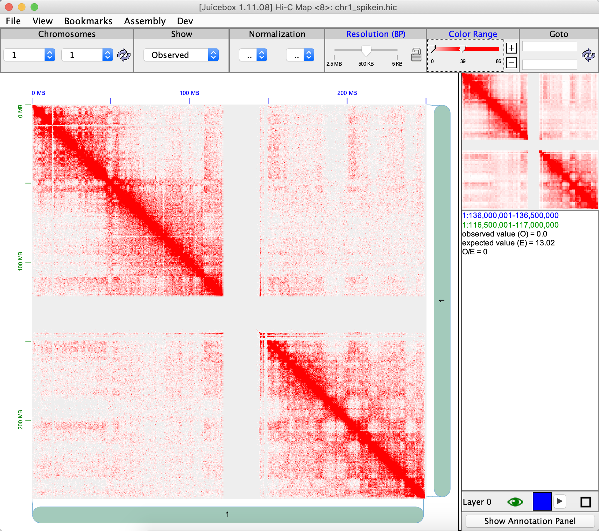

```{r, include = FALSE}
knitr::opts_chunk$set(
  collapse = TRUE,
  comment = "#>"
)
```

## Introduction

FreeHi-C (v2.0) is short for Fragment interactions empirical estimation for fast simulation of Hi-C data. It is a data-driven Hi-C data simulator for simulating and augmenting Hi-C datasets. FreeHi-C employs a non-parametric strategy for estimating an interaction distribution of genome fragments and simulates Hi-C reads from interacting fragments. Data from FreeHi-C exhibit higher fidelity to the biological Hi-C data. FreeHi-C not only can be used to study and benchmark a wide range of Hi-C analysis methods but also boosts power and enables false discovery rate control for differential interaction detection algorithms through data augmentation. Different from FreeHi-C (v1.0), a spike-in module is added enabling the simulation of true differential chromatin interactions.

The fragment level package is available here: [YeZheng/FreeHiC](https://github.com/yezhengSTAT/FreeHiC)


## Method

Here is a contact matrix of human genome chromosome 1. All the red dots are contact counts. The X axis and Y axis are sequence indices.

```{r gm12878-chr1, echo=FALSE}
knitr::include_graphics("gm12878_chr1.png", dpi = 300)
```

To save this symmetric and sparse matrix, we use $(x, y, \text{count})$, where x and y are location, and count is the number of count in the location.

Then "FreeHiCLite" performs the following procedures to simulate the contact matrix.

1. Calculate the total number of contact counts $N = \sum_{ij}n_{ij}$ where $n_{ij}$ is the contact counts at location $(i, j)$ in the matrix.

2. Estimate $\pi_{ij} = \frac{n_{ij}}{N}$. We assume the contact matrix follows a multinomial distribution.

3. Sample new counts $\hat{n_{ij}} \sim Binomial(\text{SeqDepth}, \pi_{ij})$. Where `*SeqDepth*` is provided by user.

4. Sample a random variable $r_{\text{noise}}$ from Uniform(0, 1). If $r_{\text{noise}} \le \text{noiseRate}$, let $\hat{M_{ij}}$ add or minus one with equal probability. This step is approximate deletion, insertion. `*noiseRate*` is provided by user.

5. If user specified `*neighborZeroRate*` > 0. Calculate zero rate as $p_{0} = \sum_{ij}I(n_{ij} = 0) / M^2$, where $M$ is the number of locations. 

For each location $(i, j, n_{ij})$ with $n_{ij} > 0$, calculate its neighborhood non-zero probability as $p_{\text{neighbor}} = \frac{2}{|i_{prev} - i| * |j_{prev} - j|}$ (previous closest location, we order all the location based on $j$ and $i$). 
Then select a random number $r$. If $r < p_{\text{neighbor}}$, randomly select an index $(i_{r}, j_r)$ from the whole matrix and assign $n_{i_rj_r} = 1$. Also let $n_{ij} = n_{ij} - 1$.

## Usage

To fulfill the needs of use FreeHi-C with the processed data, contact matrix. We implement "FreeHiCLite" package, which can use multi-nomial sampling and directly functional on both contact matrix and [`.hic`](https://github.com/aidenlab/juicer/wiki/Data) file directly.


```{r setup}
library(FreeHiCLite)
set.seed(123456789)
```

Read a data from a hic file.

```{r load-hic}
localFilePath = system.file("extdata", "example.hic", package = "FreeHiCLite")
unit = "BP"
resolution = 5000L

dat <- readJuicer(file=localFilePath, chromosomes="chr1", pairs = NULL, unit=unit, resolution=resolution)
str(dat)
```

The contact matrix has form

```{r, echo=FALSE}
knitr::kable(
  head(data.frame(dat[['contact']][['1_1']])), align = "llr"
  )
```

### FreeHi-C

We can use `readJuicer()` to extract the data, then perform this simulation. 

```{r FreeHiC-matrix}
contacts <- dat$contact
seqDepth <- 1000000L
countScale <- 0
noiseRate <- 0.2
neighborZeroRate <- 0.1

res <- FreeHiC(contacts, seqDepth, countScale, noiseRate, neighborZeroRate, resolution)
```

After we perform `FreeHiC()`, we can visualize the result via juicebox. Here are the following command to use.

```{r write-freehic, eval=FALSE}
writeJuicer(res, 'chr1.txt')
```

Here our genomeID is hg19.

```{r creat-hic, engine="bash", eval=FALSE}
java -jar /path/to/juicer_tool.jar pre chr1.txt chr1.hic genomeID
```

Here is the simulated matrix.

```{r compare}
knitr::include_graphics("simu_chr1.png")
```

We can also directly use `FreeHiCJuicer()` to perform simulation directly on the `.hic` file.

```{r freehicJuicer, eval = FALSE}
res <- FreeHiCJuicer(file=localFilePath, chromosomes=c("chr1", "chr2", "chr3"),
                     pairs = NULL, unit=unit, resolution=resolution,
                     seqDepth = seqDepth, countScale = countScale,
                     noiseRate = noiseRate, neighborZeroRate = neighborZeroRate)
```


### SpikeIn

The detail of method can be found in: [YeZheng/FreeHiC/SpikeIn](https://github.com/yezhengSTAT/FreeHiC/tree/master/SpikeInModule).

Here `FreeSpikeIn()` provide a function to add spikein in our contact matrix.

To smooth the spikein signal, we use [kdtree2](https://github.com/jmhodges/kdtree2) for fast range based query, and Gaussian kernel smoothing to smooth the neighborhood.

```{r spikein}
## create a spikeIn rate
contactBackground <- contacts[['1_1']]
Ns <- 0.1 * NROW(contactBackground)
spikeIn <- contactBackground[sample(1:NROW(contactBackground), Ns),]
spikeIn[,3] <- spikeIn[,3] * sample(c(seq(0, 1, 0.5), seq(1, 5, 0.5)), Ns, replace = TRUE)

spikeInRes <- FreeSpikeIn(contactBackground, spikeIn, kernelSmooth = TRUE, bandwidth = 5000)
```

```{r write-spikein, eval=FALSE}
writeJuicer(spikeInRes, '1_1', 'chr1_spikein.txt')
```

```{r spikein-visual, echo=FALSE}

```

We can also perform spikein with `FreeHiC()`.

```{r spikein-freehic}
spikeInFreeHiC <- FreeHiC(spikeInRes, seqDepth = sum(contactBackground[,3]), countScale = 0, noiseRate = 0.5, neighborZeroRate = 0.01, resolution = 5000)
```

```{r write-spfree, eval =FALSE}
writeJuicer(spikeInFreeHiC, '1_1', 'chr1_spikein_free.txt')
```

```{r spikeinfree-visual, echo=FALSE}

```


## References

