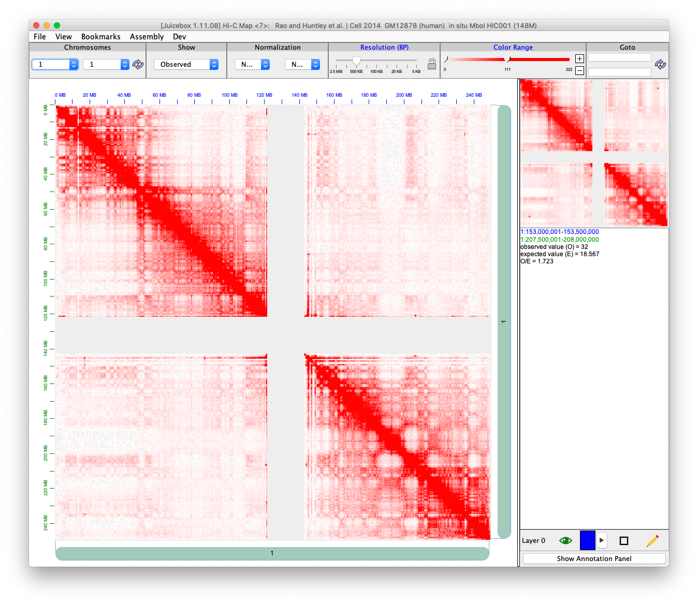

```{r, include = FALSE}
library(knitr)
knitr::opts_chunk$set(
  collapse = TRUE,
  comment = "#>"
)
```

## Introduction

The [`.hic`](https://github.com/aidenlab/juicer/wiki/Data) file is a highly compressed binary file, which is developed in the [Aiden Lab](http://aidenlab.org/). Which can be used in [juicebox](https://aidenlab.org/juicebox/) for contact matrix visualization.

The `.hic` file is formatted as [HiC Format](https://github.com/aidenlab/Juicebox/blob/master/HiCFormatV8.md). To program with `.hic` file, they provide [straw](https://github.com/aidenlab/straw) and [Dump](https://github.com/aidenlab/juicer/wiki/Data-Extraction) to extract the information from the `.hic` file. The `FreeHiCLite::readJuicer()` adopts most from the C++ version of straw.

The `.hic` file only contains two units of resolution, and each unit contains a fix set of resolutions.

1. Base-pair-delimited resolutions (**BP**): 2.5M, 1M, 500K, 250K, 100K, 50K, 25K, 10K, and 5K.
2. Fragment-delimited resolutions (**FRAG**): 500f, 250f, 100f, 50f, 20f, 5f, 2f, 1f.

The following figure shows how juicebox visualized a human genome at chromosome 1.

```{r show-hic-img, echo=FALSE}

```

## Usage

```{r setup}
library(FreeHiCLite)
```

### File type

The 'FreeHiCLite' can access two type of hic file, one is local file, the other is remote file.
The remote file lists can be found in [http://aidenlab.org/data.html](http://aidenlab.org/data.html).

### Read basic information

To access basic information about a `.hic` file. We can use function `readJuicerInformation()`. For example, we want to know which *genomeID* and what are the available *resolutions* of a remote file locates in: [https://hicfiles.s3.amazonaws.com/hiseq/gm12878/in-situ/combined.hic](). Besides, it will also extract the chromosomes sizes.

```{r remote-info}
## Remote file location. The reomte file include downloading, it may take a while
remoteFilePath = "https://hicfiles.s3.amazonaws.com/hiseq/gm12878/in-situ/combined.hic"
remoteInfo <- readJuicerInformation(remoteFilePath, verbose = TRUE)
```

```{r re-chr, echo=FALSE}
cs <- remoteInfo$chromosomeSizes
rows <- seq_len(nrow(cs) %/% 2)
suppressWarnings(kable(list(cs[rows,1:2],  
           matrix(numeric(), nrow=0, ncol=1),
           cs[-rows, 1:2]), 
      caption = "Chromsome size in the file.", booktabs = TRUE))
```

We can also use it to a local file

```{r local-info}
## Local file location
localFilePath = system.file("extdata", "example.hic", package = "FreeHiCLite")
localInfo <- readJuicerInformation(localFilePath, verbose = TRUE)
```

### Read a resolution

The 'FreeHiCLite' package provide a `readJuicer()` function to read file of chromosomes at a specific resolution.

The `example.hic` data is a small customized file with only three resolutions in BP. 

#### By chromosomes

If you input `chromosomes` and set `pairs = NULL`, `readJuicer()` will read all the possible pair for the hic file. 

```{r read-chrom}
## Chromosomes needs to be extract
chromosomes = c("chr1", "chr2", "chr3")

## Pairs needs to be extract
pairs = NULL
unit = "BP"
resolution = 500000L

dat <- readJuicer(file=localFilePath, chromosomes=chromosomes, pairs = pairs, unit=unit, resolution=resolution)

str(dat)
```

The result object contains 

- `contact`: A list of contact matrixes. For each matrix, the name stands for `chrA_chrB`, and matrix has has format (x, y, count).

```{r, echo=FALSE}
knitr::kable(
  head(data.frame(dat[['contact']][['1_1']])), align = "llr"
  )
```


#### By pairs

You can also just input `pairs`. The function will only use `pairs` if it is not `NULL`.


```{r read-pair}
## Chromosomes needs to be extract
chromosomes = c("chr1", "chr2", "chr3")

## Pairs needs to be extract
pairs = c("1_1")
unit = "BP"
resolution = 500000L

dat <- readJuicer(file=localFilePath, chromosomes=chromosomes, pairs = pairs, unit=unit, resolution=resolution)

names(dat$contact)
```


### Write to disk

We provide two functions: `convertJuicer()` and `writeJuicer()` to write the resulting contact matrix into a [short with score format](https://github.com/aidenlab/juicer/wiki/Pre#short-with-score-format)

```{r convert}
cs <- convertJuicer(dat[['contact']][['1_1']], '1', '1')
```

The result looks like the following table.

```{r, echo=FALSE}
knitr::kable(head(cs), align = 'lllllllll')
```

We can also use `writeJuicer()` to directly write to file.

```{r, eval =FALSE}
writeJuicer(dat[['contact']], file = 'test.txt')
```

After you write to disk, you can run [juicer](https://github.com/aidenlab/juicer/)'s [Pre](https://github.com/aidenlab/juicer/wiki/Pre) function to produce a `.hic` file for display purpose. Here we display an example code of running Pre command. 

```{r, engine='bash', eval=F}
java -jar /path/to/juicer_tool.jar pre test.txt test.hic genomeID 
```

## References

1. Neva C. Durand, Muhammad S. Shamim, Ido Machol, Suhas S. P. Rao, Miriam H. Huntley, Eric S. Lander, and Erez Lieberman Aiden. ["Juicer provides a one-click system for analyzing loop-resolution Hi-C experiments."](https://www.cell.com/cell-systems/fulltext/S2405-4712(16)30219-8) Cell Systems 3(1), 2016.

